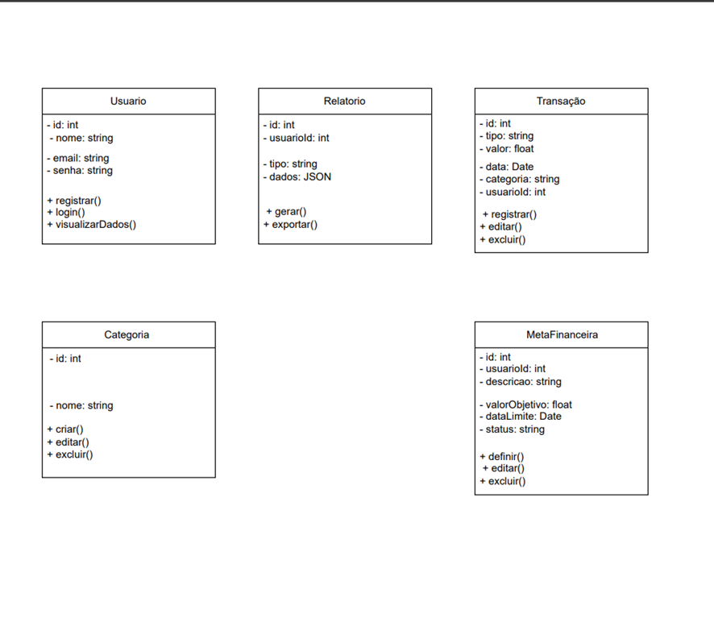

# DESCRIÇÃO DO PROJETO
 
# INTRODUÇÃO

1  O Projeto de Controle de Gastos visa auxiliar indivíduos e famílias no gerenciamento eficiente de suas finanças pessoais.
Através de uma plataforma intuitiva, será possível registrar receitas, despesas e visualizar relatórios detalhados para melhor tomada de decisão financeira.

2  O principal objetivo do projeto é fornecer uma ferramenta acessível e prática para ajudar os usuários a monitorar seus gastos, identificar padrões de consumo e planejar seu orçamento de forma mais eficaz.

3  O sistema verifica a categoria da despesa informada pelo usuário.
As categorias disponíveis são: "Alimentação", "moradia", "impostos" entre "Outros".

4  Após a verificação da categoria, a despesa é registrada no sistema.
O sistema atualiza o saldo do usuário, subtraindo o valor da despesa registrada.

5  O sistema verifica se o usuário possui um limite de gastos definido.
Caso o limite exista, o sistema compara o valor da despesa com o limite estabelecido.

Se a despesa exceder o limite definido, o sistema notifica o usuário sobre o ocorrido.

6  Com base no período selecionado, o sistema gera um relatório detalhado das despesas do usuário.
O usuário pode analisar o relatório gerado, verificando seus gastos por categoria e período.

7  O processo de análise de despesas é finalizado.

id: Identificador único do usuário (int).
nome: Nome completo do usuário (string).
email: Endereço de e-mail do usuário (string).
senha: Senha do usuário (string)
registrar(): Permite o registro de um novo usuário.
login(): Permite o login de um usuário existente.
visualizarDados(): Permite visualizar os dados do usuário.
id: Identificador único da transação (int).
tipo: Tipo de transação (string).
valor: Valor da transação (float).
data: Data da transação (Date).
categoria: Categoria da transação (string).
usuariold: ID do usuário que realizou a transação (int).
registrar(): Permite o registro de uma nova transação.
editar(): Permite editar os dados de uma transação existente.
excluir(): Permite excluir uma transação existente.
id: Identificador único da notificação (int).
usuariold: ID do usuário ao qual a notificação se destina (int).
mensagem: Mensagem da notificação (string).
data: Data da notificação (Date).

#Funcionalidades do Sistema

O diagrama de classes representa as funcionalidades básicas de um sistema financeiro, incluindo:

Gerenciamento de usuários (registro, login, visualização de dados).
Geração e exportação de relatórios financeiros.
Registro, edição e exclusão de transações financeiras.
Gerenciamento de categorias de transações.
Definição, edição e exclusão de metas financeiras.

Este diagrama de classes fornece uma visão geral da estrutura e funcionalidades do sistema financeiro. Ele pode ser utilizado como base para o desenvolvimento do sistema, auxiliando na compreensão das entidades, seus atributos e seus relacionamentos.
